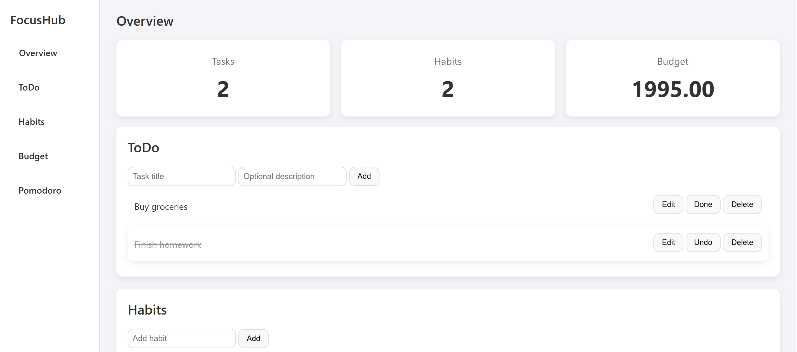
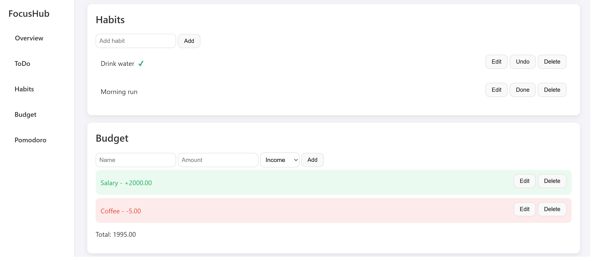
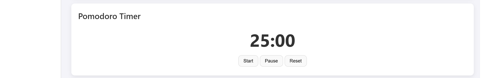

  <h1>🎯 FocusHub</h1>
  
  
A modular productivity web application featuring ToDo management, Habit tracking, Budgeting, and a Pomodoro Timer—all in one place.

  
  
  
  

   

  ### 🚀 [View Live Demo](https://my-focus-hub.vercel.app/) 🚀

---

## ✨ Key Features

- 📊 **Overview Dashboard:** Instant insights into your daily productivity, including active tasks, habits, and current budget balance.
- ✅ **Smart ToDo List:** Full CRUD functionality (Create, Read, Update, Delete) for tasks with completion status toggling.
- 🔄 **Habit Tracker:** Build long-term routines with a daily habit tracker that automatically resets every new day.
- 💰 **Budget Manager:** Track your income and expenses with real-time balance calculation and transaction history.
- ⏱️ **Pomodoro Timer:** A classic 25-minute productivity timer to help you stay focused using the Pomodoro technique.

## 🛠️ Technical Implementation & Deployment

This project was built without external frameworks to demonstrate a strong grasp of core web technologies:

- **Frontend:** Semantic HTML5 and responsive CSS3 (Flexbox/Sticky layouts).
- **Logic:** Vanilla JavaScript (ES6+) with a **Modular Architecture** to keep the code clean and maintainable.
- **State Management:** Implementation of a custom global store using **LocalStorage** for data persistence (data remains after page refresh).
- **Hosting:** Deployed via **Vercel** with automated **CI/CD** pipelines from GitHub.

## 📂 Project Structure

- `index.html` — Main entry point and application structure.
- `styles/layout.css` — Custom styling and UI components.
- `js/store.js` — Global state logic and LocalStorage integration.
- `js/tasks.js`, `habits.js`, `budget.js`, `timer.js` — Modular components handling specific business logic.

## 📸 Screenshots

  
<b>Click to expand screenshots</b>

  
   
  
  **Dashboard & ToDo Section:**
  

  **Habits & Budgeting:**
  

  **Pomodoro Timer:**
  

